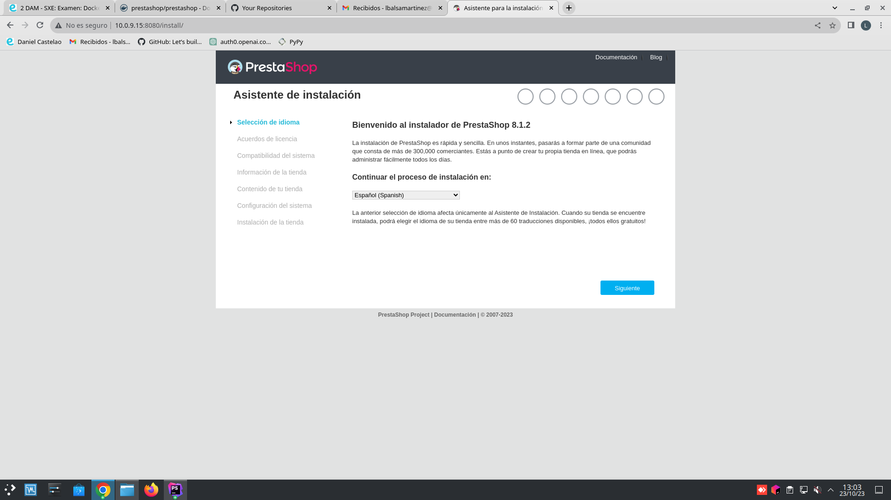
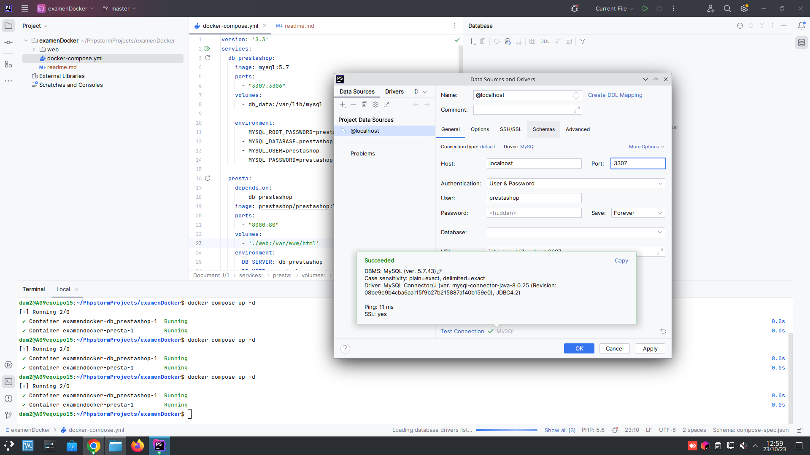

## Examen Docker: Levantar PrestaShop ##

**1. Buscar información de PrestaShop**<br>
PrestaShop es un sistema de gestión de contenidos libre y de código abierto pensado para 
construir desde cero tiendas en línea de comercio electrónico. 
Enfocado para permitir crear tiendas en línea desde pequeñas empresas 
a grandes corporaciones.
Cuenta con un amplio mercado de temas con los que personalizar la tienda 
y más de 5000 módulos, entre gratuitos y de pago, con los que adaptar 
las funcionalidades propias de la herramienta.


**2. Buscar imagen de PrestaShop en DockerHub**<br>
Necesitamos la imagen de PrestaShop para nuestro contenedor, la cual obtendremos de
[DockerHub](https://hub.docker.com/r/prestashop/prestashop/).

**3. Crear docker-compose.yml**<br>
En nuestro proyecto, creamos un fichero llamado docker-compose.yml, en el cual
pondremos la configuración para ejecutar PrestaShop.

El fichero quedaría así:

```
version: '3.3'
services:
  db_prestashop:
    image: mysql:5.7
    ports:
      - "3307:3306"
    volumes:
      - db_data:/var/lib/mysql

    environment:
      - MYSQL_ROOT_PASSWORD=prestashop
      - MYSQL_DATABASE=prestashop
      - MYSQL_USER=prestashop
      - MYSQL_PASSWORD=prestashop

  presta:
    depends_on:
      - db_prestashop
    image: prestashop/prestashop:latest
    ports:
      - "8080:80"
    volumes:
      - './web:/var/www/html'
    environment:
      DB_SERVER: db_prestashop
      DB_USER: prestashop
      DB_PASSWORD: prestashop
      DB_NAME: prestashop
volumes:
  db_data: {}
```


Comentaremos brevemente este código:

- Definimos dos servicios: db_prestashop (el servidor de la base de datos 
MySQL) y presta (PrestaShop).

**Servicio db_prestashop:**
- Expone el puerto 3307 en el host y lo conecta al puerto 3306 en el contenedor de MySQL.
- Crea un volumen llamado db_data para almacenar los datos de MySQL.
- Establecemos usuario, contraseña, etc. 

**Servicio presta (PrestaShop):**
- Depende de db_prestashop, lo que significa que se asegurará de que la base de datos
MySQL esté en funcionamiento antes de iniciar PrestaShop.
- Expone el puerto 8080 en el host para acceder a PrestaShop.
- Crea un volumen que vincula la carpeta ./web del sistema local al directorio 
/var/www/html en el contenedor de PrestaShop.
- Establecemos usuario, contraseña, etc.

**Volumen db_data:**
- Define un volumen llamado db_data que almacena los datos de la base de datos MySQL 
para que no se pierdan cuando se detienen o eliminan los contenedores.

Finalmente, lanzamos el comando `$ docker compose up -d`, para levantar el contenedor
y que empiece a funcionar.

Para comprobar su correcto funcionamiento, escribimos en el navegador nuestra dirección IP
seguida del puerto 80, es decir:

http://10.0.9.15:8080 para que nos lleve a la página de inicio de sesión.



Aparte de esto, podemos comprobar la conexión a la base de datos mediante
el IDE. 

- Creamos una base de datos MySql, en la cual pondremos el usuario y contraseña
facilitados previamente (prestashop y prestashop), ponemos el puerto,
y le damos a test connection, dando como resultado lo siguiente:




